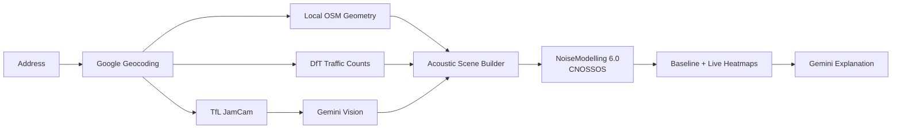

# 🔊 StilleMap

<p>
  
  
  
  
  
  
</p>

**Making city noise visible.**

<p align="center">
  
</p>

### 👉 [Launch the live app](https://stillemap-748083868426.europe-west2.run.app/)

StilleMap is an autonomous urban-noise digital twin. Give it a London address and it assembles the local city geometry, gathers traffic evidence, interprets live street conditions, runs a real CNOSSOS acoustic simulation, and renders an explainable street-level noise map.

> **AI interprets the city. NoiseModelling calculates the decibels.**

### Google Cloud + Pydantic

StilleMap uses **Google Cloud** as the production runtime and AI platform:

- **Cloud Run** hosts the FastAPI application and the embedded NoiseModelling runtime.
- **Cloud Build + Artifact Registry** build and ship the deployable service image.
- **Google Maps Platform** provides geocoding and weather context.
- **Gemini** provides multimodal traffic interpretation from TfL camera imagery and a grounded explanation of the completed simulation.
- Production geometry is packaged as a local Greater London OSM GeoPackage, removing public Overpass from the critical path.

**Pydantic is the contract layer between AI, APIs and deterministic physics.** 

Request/response models validate pipeline inputs, while Gemini's visual observation is constrained to a typed 
`CameraObservation` schema — vehicle counts, congestion, apparent speed, visibility and confidence. 

All architecture has an elevated robustness: the model is not allowed to invent traffic flow rates or decibels; 
deterministic Python transforms validated observations into acoustic inputs, 
and NoiseModelling calculates the result.

---

## Why

Noise pollution is one of the least visible parts of city life.

The physics already exists: [NoiseModelling](https://github.com/Universite-Gustave-Eiffel/NoiseModelling), developed by Université Gustave Eiffel, is a powerful open-source acoustic simulation engine. But turning maps, buildings, traffic counts, live observations, receivers and acoustic parameters into a working urban model is still specialist-heavy.

**StilleMap automates that entire workflow.**

```text
city geometry
+ official traffic observations
+ live camera context
+ deterministic traffic assumptions
+ CNOSSOS acoustic physics
──────────────────────────────────
street-level noise digital twin
```

---

## ⚡ Demo

1. Enter a London address.
2. Click **Analyse**.
3. Watch the modelling pipeline complete live.
4. See the nearest TfL JamCam frame and Gemini traffic observation.
5. Explore the road sources, receiver points and noise heatmap.
6. Compare the strategic baseline with the live traffic scenario.
7. Read a grounded explanation of what changed and why.

```text
Locate address                 ✓
Weather context                ✓
OSM streets + buildings        ✓
DfT traffic counts             ✓
TfL JamCam                     ✓
Gemini traffic vision          ✓
Build acoustic scene           ✓
CNOSSOS baseline               ✓
CNOSSOS live scenario          ✓
Gemini explanation             ✓
```

---

## 🧠 The Core Idea: Proxy Evaluation

Most urban datasets were not designed to measure noise directly.

StilleMap combines **proxy signals** collected for completely different purposes:

- **OpenStreetMap** → city geometry
- **Department for Transport** → measured traffic volumes
- **TfL JamCams** → current visual traffic state
- **Google APIs** → geocoding and environmental context
- **Gemini** → multimodal interpretation and synthesis

Those signals are converted into deterministic acoustic inputs and evaluated by NoiseModelling.

> **Models observe and explain. Deterministic code transforms. Acoustic physics decides.**

Gemini never invents vehicles/hour, sound levels or CNOSSOS outputs.

---

## 🏗️ Architecture



```text
address
  │
  ├── Google Geocoding + Weather
  ├── local Greater London OSM GeoPackage
  ├── DfT Road Traffic Statistics
  ├── TfL JamCam
  │      └── Gemini structured traffic observation
  │
  └── acoustic preparation
         ├── BUILDINGS
         ├── ROADS
         └── RECEIVERS
                │
                ▼
         NoiseModelling 6.0
                │
         ┌──────┴──────┐
         ▼             ▼
    Baseline DEN    Live D/E/N
         └──────┬──────┘
                ▼
         interactive map
```

---

## 🔬 Design Principles

| Principle                       | Implementation                                                                               |
|---------------------------------|----------------------------------------------------------------------------------------------|
| **Real acoustic physics**       | Noise levels come from NoiseModelling 6.0 / CNOSSOS, not an LLM.                             |
| **Explicit provenance**         | Every source, assumption and simulation artifact is recorded per run.                        |
| **No hidden source fallback**   | Missing providers stay missing; source changes are explicit configuration.                   |
| **Observed-data averages only** | Missing traffic values may use averages only from observations collected in the current run. |
| **Localized AI influence**      | JamCam observations affect only nearby supported roads and only the current time period.     |
| **Offline OSM geometry**        | Production uses a local Greater London GeoPackage instead of public Overpass.                |
| **Reproducible runs**           | Every stage writes inspectable JSON, GeoJSON, imagery and NoiseModelling logs.               |

The baseline and live scenarios are deliberately isolated. A camera snapshot can influence the **current D/E/N period**, but it never rewrites the strategic **DEN baseline**.

---

## 🚀 Quick Start

### 1. Install

```bash
git clone https://github.com/akaliutau/stillemap.git
cd stillemap

conda create -n stillemap python=3.12 -y
conda activate stillemap
pip install -r requirements.txt
```

### 2. Configure

```bash
cp .env.example .env
```

Typical API-key mode:

```dotenv
GOOGLE_GENAI_USE_VERTEXAI=false
GEMINI_API_KEY=...
GOOGLE_MAPS_API_KEY=...
TFL_APP_KEY=...
```

To create API keys, use the standard approach, f.e. 
```bash
gcloud services enable \
  geocoding-backend.googleapis.com \
  weather.googleapis.com
```

then:

Google Cloud Console
-> APIs & Services
-> Credentials
-> Create credentials
-> API key

Put the keys in `.env` file


| Credential            |               Needed? | Used for                                                         |
|-----------------------|----------------------:|------------------------------------------------------------------|
| `GOOGLE_MAPS_API_KEY` |               **Yes** | Google Geocoding + Google Weather                                |
| `TFL_APP_KEY`         |               **Yes** | TfL Unified API / JamCam discovery                               |
| `GEMINI_API_KEY`      | **No** with Vertex AI | Only needed if you bypass Vertex AI and call Gemini API directly |
| GCP credentials / ADC |               **Yes** | Vertex AI Gemini + deployment                                    |
| DfT key               |                **No** | DfT API is unauthenticated                                       |
| OSM key               |                **No** | Public OSM/Overpass                                              |
| NoiseModelling key    |                **No** | Open-source local runtime                                        |

### 3. Build the local London OSM cache

```bash
sudo apt-get install -y gdal-bin curl
scripts/download_osm_cache.sh
```

This creates:

```text
src/stillemap/data/greater-london.gpkg
```

The runtime then reads buildings and drivable roads locally; public Overpass is not required.

### 4. Run

```bash
make api
```

Open:

```text
http://localhost:8080
```

Or run the pipeline directly:

```bash
PYTHONPATH=src python -m stillemap.cli run \
  --address "10 Downing Street, London"
```

---

## 🧪 Preflight & Debugging

Check configuration without making external API calls:

```bash
PYTHONPATH=src python -m stillemap.cli preflight
```

Plan a run without executing providers:

```bash
PYTHONPATH=src python -m stillemap.cli run \
  --address "10 Downing Street, London" \
  --no-run
```

Every real run is inspectable:

```text
runs/<run-id>/
├── debug.log
├── result.json
├── 01_geocode/
├── 02_weather/
├── 03_osm/
├── 04_dft/
├── 05_tfl/
├── 06_ai_camera/
├── 07_prepare/
├── 08_noisemodelling_baseline/
├── 09_noisemodelling_live/
└── 10_ai_explain/
```

If a stage fails, the raw artifacts remain available for diagnosis.

---

## ☁️ Google Cloud Run

The deployed service uses the same FastAPI application and pipeline as local development.

NoiseModelling is embedded directly into the service image, and the prepared Greater London OSM GeoPackage is baked into the image as well.

```bash
# one-time cloud resources / secrets
scripts/deploy_infra.sh

# build image + deploy service
scripts/deploy_service.sh
```

For the demo, run artifacts needed by the browser are streamed back in the same response, avoiding Cloud Run instance-local filesystem routing issues.

---

## 🧩 Stack

| Layer | Technology |
|---|---|
| UI | MapLibre GL JS |
| API | FastAPI |
| Geospatial | GeoPandas, Shapely, GDAL |
| City geometry | OpenStreetMap / Geofabrik |
| Traffic | UK Department for Transport |
| Live street context | TfL JamCams |
| Multimodal AI | Gemini |
| Acoustic engine | NoiseModelling 6.0 |
| Acoustic method | CNOSSOS |
| Cloud | Google Cloud Run |

---

## 🎯 Vision

Weather maps made atmospheric conditions visible. Traffic maps made congestion visible.

**StilleMap does the same for urban noise.**

The broader pattern is reusable: discover signals already collected across a city, combine them as proxies for a harder-to-measure phenomenon, and evaluate them with a domain model that stays grounded, inspectable and auditable.

---

## ⚖️ License

MIT

---

**StilleMap: Map the noise. Find the quiet.**
